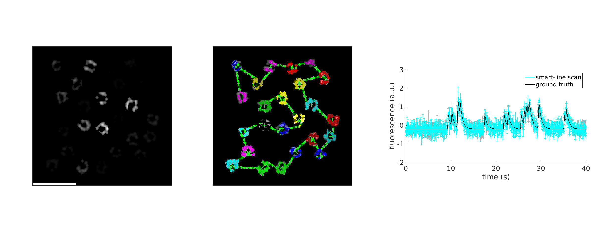

# GCaMP6 artificial movies

Code implementing the simulation of the fluorescence of a population of neurons expressing the GCaMP6 calcium indicator and the sampling with Smart-line scan.

### Prerequisites

* Matlab 2017a.
* [tsp_ga, genetic algorithm](https://it.mathworks.com/matlabcentral/fileexchange/13680-traveling-salesman-problem-genetic-algorithm)

### Installing

Just download the repository to your computer and add the folder containing the scripts to the matlab path.

### Authors
* [Manuel Molano](https://github.com/manuelmolano).

*This work has received funding from the European Union's Horizon 2020 research and innovation programme under the Marie Sklodowska-Curie grant agreement No 699829 (ETIC).*

![][100x100](figs/LOGO.png)

